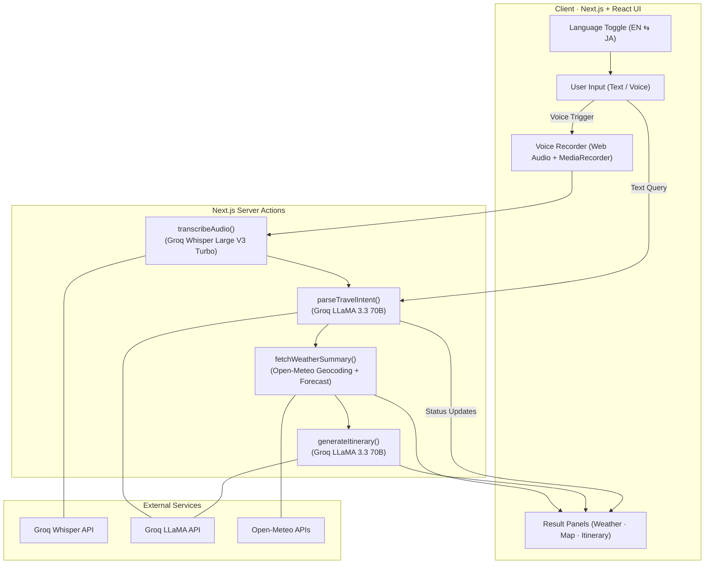

# 🌍 Travel Outfit Assistant

**Live Demo:** [https://travel-voice-assistent.vercel.app](https://travel-voice-assistent.vercel.app/)


---

## 📖 Description

**English:**  
An intelligent, bilingual (Japanese/English) travel planning assistant that combines real-time weather data with AI-powered outfit recommendations and voice input capabilities. Simply speak or type your travel destination, and get personalized clothing suggestions, weather forecasts, and travel tips powered by advanced AI models.

**日本語:**  
リアルタイムの天気データとAI駆動の服装提案、音声入力機能を組み合わせたインテリジェントな二言語（日本語・英語）旅行計画アシスタントです。旅行先を話すか入力するだけで、高度なAIモデルによるパーソナライズされた服装提案、天気予報、旅行のヒントが得られます。

---

## ✨ Key Features

**English:**
- 🎤 **Voice Input Support** - Record travel queries in Japanese or English using advanced speech recognition (Groq Whisper Large V3 Turbo)
- 🌍 **Bilingual Interface** - Seamlessly switch between Japanese and English with full localization
- 🌤️ **Real-time Weather Data** - Live weather forecasts powered by Open-Meteo API with 5-day predictions
- 🤖 **AI-Powered Recommendations** - Smart outfit suggestions based on weather, culture, and destination using LLaMA 3.3 70B
- 🗺️ **Interactive Maps** - Visual location display with OpenStreetMap integration
- 📱 **Responsive Design** - Clean, professional UI optimized for all devices
- ⚡ **Fast Performance** - Optimized API calls with minimal latency using Groq's fastest models

**日本語:**
- 🎤 **音声入力対応** - 高度な音声認識（Groq Whisper Large V3 Turbo）を使用して、日本語または英語で旅行クエリを録音
- 🌍 **二言語インターフェース** - 完全なローカライゼーションで日本語と英語をシームレスに切り替え
- 🌤️ **リアルタイム天気データ** - Open-Meteo APIによる5日間の予報を含むライブ天気予報
- 🤖 **AI駆動の提案** - LLaMA 3.3 70Bを使用した天気、文化、目的地に基づくスマートな服装提案
- 🗾 **日本に特化** - 主要な日本の都市（東京、大阪、京都、札幌、福岡、那覇）のプリロードされた天気カード
- 🗺️ **インタラクティブマップ** - OpenStreetMap統合による視覚的な場所表示
- 📱 **レスポンシブデザイン** - すべてのデバイスに最適化されたクリーンでプロフェッショナルなUI
- ⚡ **高速パフォーマンス** - Groqの最速モデルを使用した最小限のレイテンシで最適化されたAPI呼び出し

---

## 🏗️ System Architecture



---

## 🛠️ Tech Stack

### Frontend
- **Framework:** Next.js 16 (App Router) with React 19.2
- **Language:** TypeScript 5
- **Styling:** Tailwind CSS 4
- **UI Components:** Lucide React (Icons)
- **Maps:** React Leaflet + OpenStreetMap
- **Animations:** Framer Motion
- **State Management:** React Hooks + SWR

### Backend / APIs
- **AI/ML:**
  - Groq SDK (LLaMA 3.3 70B Versatile for chat)
  - Groq Whisper Large V3 Turbo (Speech-to-text)
- **Weather Data:** Open-Meteo API (Free, no API key required)
- **Geocoding:** Open-Meteo Geocoding API

### Development Tools
- **Package Manager:** npm
- **Linting:** ESLint 9 with Next.js config
- **Type Safety:** TypeScript with strict mode
- **Schema Validation:** Zod 4.1
- **HTTP Client:** Axios 1.13

---

## 🚀 Example Usage

**English Queries:**
```
"What should I wear for climbing Mount Fuji?"
"Planning a trip to Osaka next week"
"What's the weather like in Kyoto?"
```

**日本語クエリ:**
```
「富士登山の服装を教えて」
「来週大阪に旅行します」
「京都の天気はどうですか？」
```
